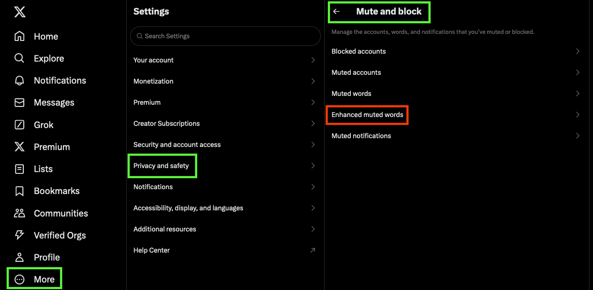
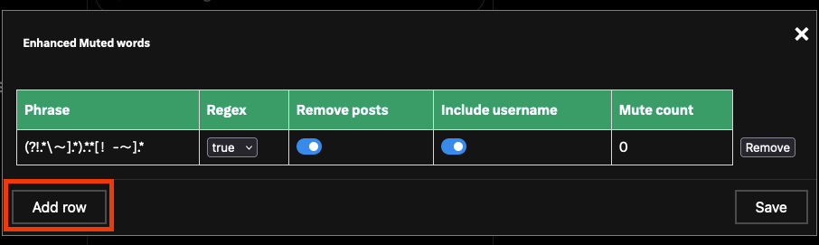
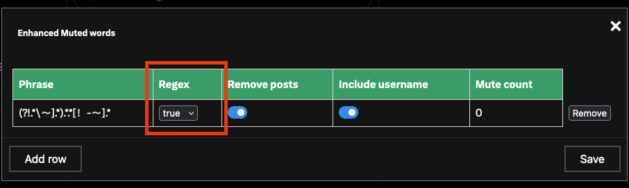
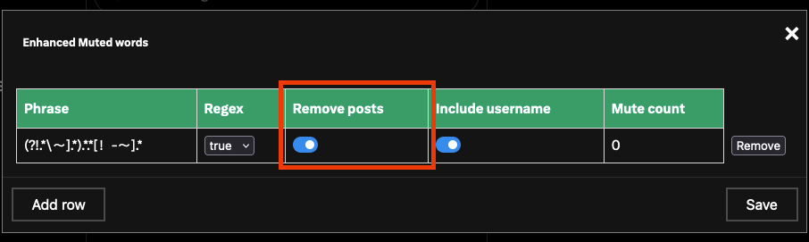
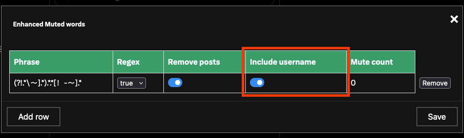
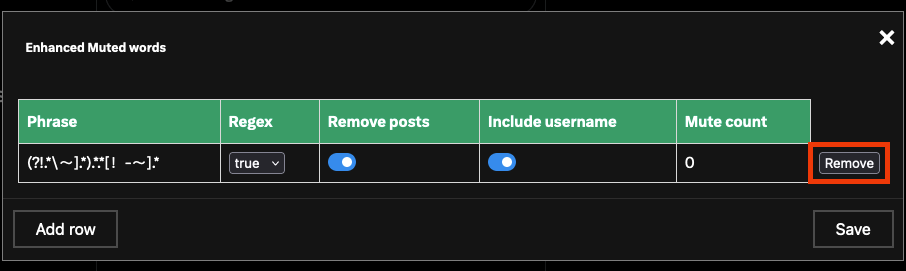
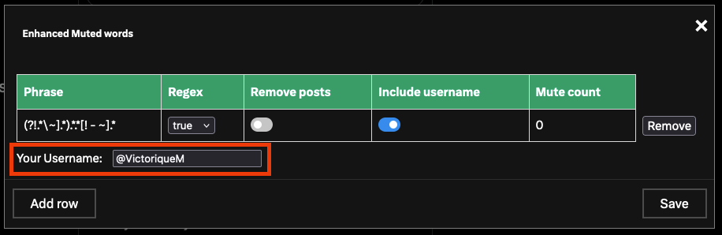

# Enhanced Twitter Post Hider

This contains a UI enhancement to Twitter that adds Enhanced Muted Words to the Twitter UI.
It provides much improved and much finer grain control of muted words, with the option for using 
regular expressions for filtering.

## Installation

This is a userscript that has been designed to run under `TamperMonkey`.  You will first need to have the tampermonkey 
plugin installed.

You then go to GreasyFork and choose Install Script:

[GreasyFork Script Repo](https://greasyfork.org/en/scripts/492269-enhanced-twitter-post-hider)

This will bring up the Tampermonkey script install with the information for the script.  Click on 
`Install` to complete the install.

## Usage

Once the script is installed and running, go to Twitter as you normally would.
In the bar on the left hand side, click on the `More` button, just above Post. And then choose `Settings and Privacy` from 
the menu.

Under Settings, choose `Privacy and Safety`, then in the far right bar choose `Muted and Block`.

You can now click on `Enhanced Muted Words` to get to the new features.



### Add Blocked Words

Click on `Add Row` to add a new row for a blocked word.  Fill in the phrase you wish to block and set the `Regex` switch 
to either true to use it as a regular expression match or false to use it as an exact match.  There are also switches for
`Remove Posts` and `Include Username`.  These are explained below.

Click `Save` to save the rows.  Your muted phrase will then be active.



> [Regular Expression Generator](https://regex-generator.olafneumann.org/?sampleText=Phrase%20goes%20here&flags=i) 
> <br> This may be useful to those not familiar with regular expressions.

#### Regex Switch
The `Regex` switch can be set to true or false.  If you set it to true then the phrase will be treated as a regular 
expression and will be used as a pattern to match against posts and optionally usernames.

If this switch is set to false, then the phrase will be used as an exact match only.



#### Remove Posts Switch
The `Remove Posts` switch can be set to on or off.  If it is set to `on` then the posts that match the phrase will be
fully removed from the timeline.  

If the switch is set to `off`, then the posts will simply be hidden on the timeline,
and can be viewed at your discretion by clicking on them.



#### Include Username Switch
The `Include Username` switch can be set to on or off.  If it is set to `on`, then the username of the post will also be
considered when matching the post.  If the username matches then the post will be hidden or removed based on the 
`Remove Posts` switch.

If the switch is set to `off`, then the username will not be considered.



### Remove Blocked Words

Click on `Remove Row` to remove a blocked word row.

Click `Save` to save the rows.  Your muted phrase will then be removed.



### Your Username

Fill in the username to be ignored in the your username field.
This allows the filter not to apply to your own posts.

Click `Save` to save the username.



## For Developers

To build the code use the following commands.

```batch
# install dependencies
    npm install
    
# build userscript
    npm run compile-prod
```

To install the code, go to the `dashboard` for `Tampermonkey`, and click on the `+` tab.

Copy the contents of the js file in the `dist` folder to the editor on the page, and then choose `Save`.

Close your browser and reopen it and the Enhanced Muted Words userscript will be active.
